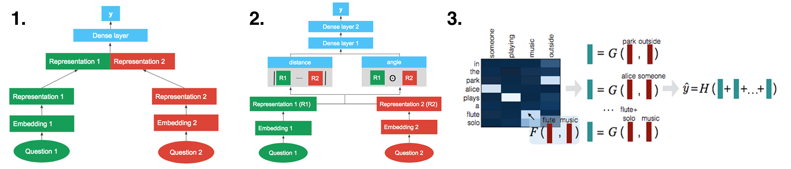

<script src="https://cdn.mathjax.org/mathjax/latest/MathJax.js?config=TeX-AMS-MML_HTMLorMML"></script>  <script type="text/javascript"></script>


# PyEnt: 

  
Author: _Mustafa Waheed (Data Scientist)_

  
## Overview

This module is meant to provide tooling and abstractions as well as examples of Entity Resolution / duplicate detection (also known as Entitty Matching) tasks using Transforner Based Deep Learning Models utilizing existing pre-training as well as some transfer learning. 
  
For the moment this is kept to the narrow target domain of person specific attributes but can expand based on relevant need. As the types of entities increase in complexity such as household or family type entities with interconnectedness or relationship among differnt entities and types we recommend adapting Graph Neural Network abstraction to help extend this solution further.
  
## Proposed ML Architecture
  
In the current case our solution primarily focuses using a runtime component of using a Bi-encoder mdoel based on Siamese Neural Network architecture create pairs of entities (emanating from different sources) that have a good chance of referring to the sane real world entity or thing/person/place. Once we have thse candidates we can train a cross-endocer model for classifying out the hard negatives with the hope of improving the classification model's recall perforance over a representative out of sample 'test' set at a given level of percision.

The over all pipeline will look something like the **3.**'rd option detailed in the following image:
  

  
[_Image courtesy of Data @ Qura_](https://quoradata.quora.com/Applying-Deep-Learning-to-Detecting-Duplicate-Questions-on-Quora)  
  

### 1. Preprocess and Split Dataset  


### 2. Bi-Encoder: Candidate Pair Selection


### 3. Cross Encoder : Entity Match Classification 
  

  
### 4. Interpret Prediction Results
  

## Acknowledgements

```bibtex 
@inproceedings{reimers-2019-sentence-bert,
    title     = "Sentence-BERT: Sentence Embeddings using Siamese   BERT-Networks",
    author    = "Reimers, Nils and Gurevych, Iryna",
    booktitle = "Proceedings of the 2019 Conference on Empirical Methods in Natural Language Processing",
    month     = "11",
    year      = "2019",
    publisher = "Association for Computational Linguistics",
    url       = "https://arxiv.org/abs/1908.10084",
}
```
  
```bibtex  
@software{de_bruin_j_2019_3559043,
  author       = "De Bruin, J",
  title        = "Python Record Linkage Toolkit: A toolkit for record linkage and duplicate detection in Python",
  month        = "12",
  year         = "2019",
  publisher    = "Zenodo",
  version      = "v0.14",
  doi          = "10.5281/zenodo.3559043",
  url          = "https://doi.org/10.5281/zenodo.3559043"
}
```